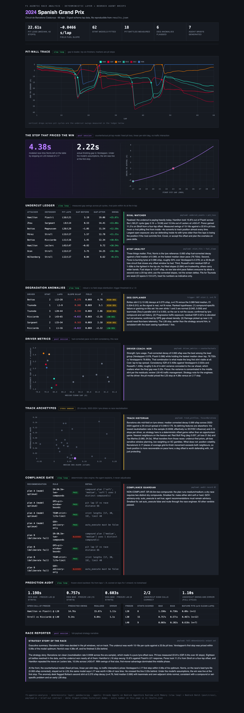
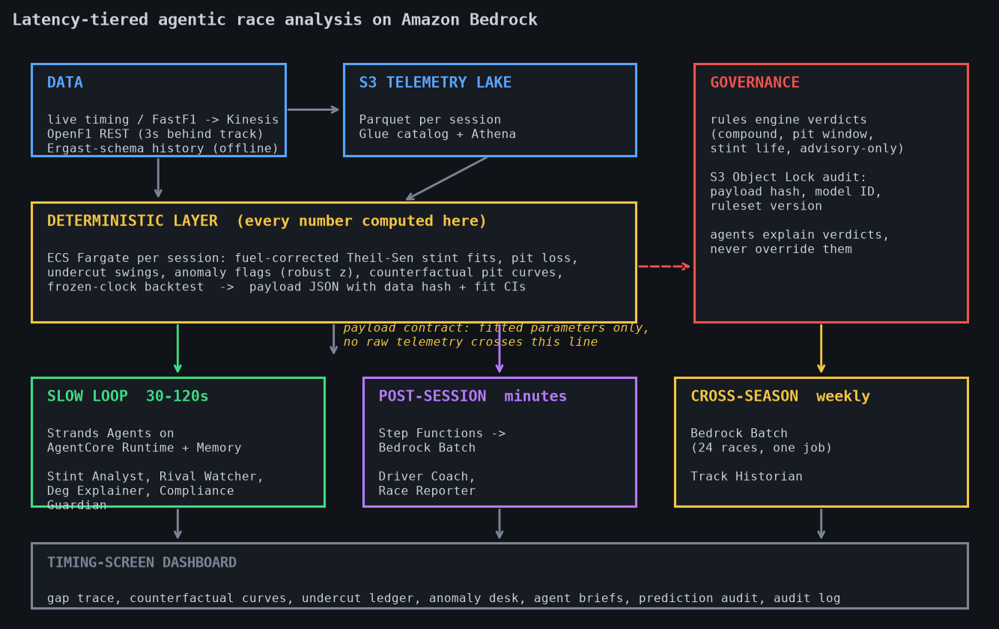
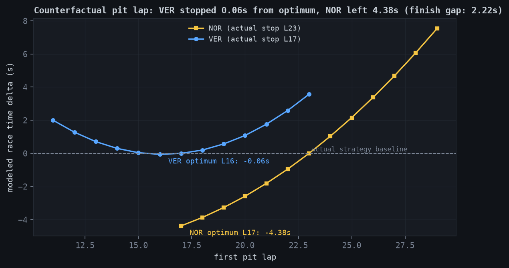
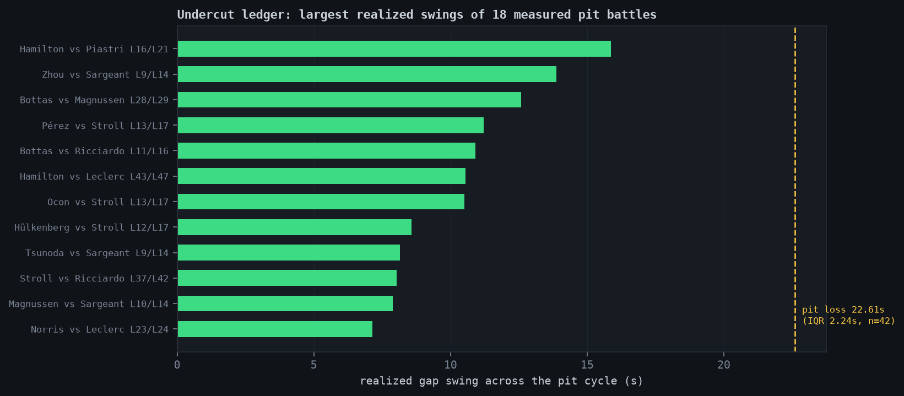
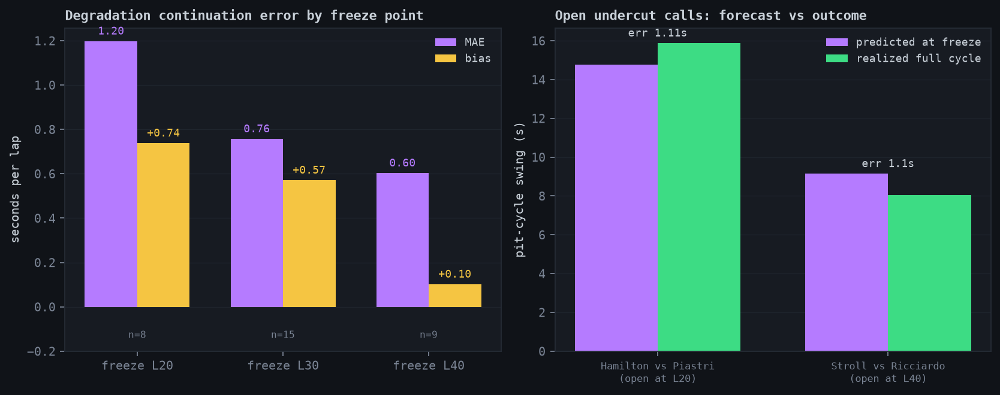

# f1-agentic-analysis

**A latency-tiered agentic race analysis system for Formula 1 data: a
deterministic analysis layer computes every number, seven Strands agents on
Amazon Bedrock turn those numbers into pit-wall briefs, and a frozen-clock
backtest proves the predictions against realized race outcomes.**

Built on real telemetry. On the 2024 Spanish Grand Prix, the counterfactual
model priced Max Verstappen's first stop within 0.06s of its optimum, showed
Lando Norris left 4.38s of modeled race time on the table against a 2.22s
finishing gap, and both undercut forecasts that were open at the tested
freeze points landed within 1.11s of the realized pit-cycle swings.



## The design position

LLM agents do not belong on the pit-call path. The decision to box resolves
in sub-second time against precomputed strategy trees, and an agent adds
latency and non-determinism to a path that tolerates neither. Agents earn
their place in three slower loops where the scarce resource is engineer
attention:

| Tier | Cadence | Runtime | Agents |
|---|---|---|---|
| slow_loop | 60s during a session | Strands Agents on Bedrock AgentCore Runtime, with AgentCore Memory | Stint Analyst, Rival Watcher, Deg Explainer, Compliance Guardian |
| post_session | minutes after the flag | Bedrock batch inference | Driver Coach, Race Reporter |
| cross_season | weekly batch | Bedrock batch inference | Track Historian |

One rule holds the system together: **agents never compute numbers.** The
deterministic layer (pandas/SciPy) produces every figure with provenance,
agents receive structured payloads and return short briefs, and a
groundedness check verifies that every numeric claim in a brief exists in
the payload. An agent with no tools cannot hallucinate a retrieval.



## What the deterministic layer computes

- **Fuel-corrected degradation fits.** Field fuel slope from clean-lap
  medians, then a robust Theil-Sen line per stint with confidence
  intervals. 62 stints fitted on the Spanish GP.
- **Circuit pit loss.** 22.61s measured over 42 stops (IQR 2.24s).
- **Undercut ledger.** 18 pit battles measured; realized swings of 10-16s
  per cycle. Hamilton's lap 16 stop swung 15.87s against Piastri.
- **Anomaly desk.** Bottas's second stint flagged at 0.275 s/lap decay
  (robust z = 4.79) with teammate and adjacent stints normal; the Deg
  Explainer ranked a set-specific cause and his early lap 28 stop agrees.
- **Counterfactual pit curves.** The chart below is the race's strategic
  story in one figure.





## Predictions vs actuals: the frozen-clock backtest

Fits see laps 1..N only; their forward statements are scored on laps N+1
onward. No quantity used for prediction sees post-freeze data.

| Freeze | Deg stints scored | Deg MAE | Deg bias | Open undercut calls | Swing abs error |
|---|---|---|---|---|---|
| Lap 20 | 8 | 1.20s | +0.74s | 1 (HAM vs PIA: pred 14.76s, real 15.87s) | 1.11s |
| Lap 30 | 15 | 0.76s | +0.57s | 0 | - |
| Lap 40 | 9 | 0.60s | +0.10s | 1 (STR vs RIC: pred 9.14s, real 8.04s) | 1.10s |

The early positive bias is itself a shipped finding: fits younger than ten
clean laps over-read tyre warmup and track evolution as degradation, so
agent briefs mark those slopes as provisional.



## The seven agents

Each agent is a Strands `Agent` whose system prompt is a ~150-word contract
in `src/f1agents/agents/prompts/`, constructed with `tools=[]`. The prompts
are the entire agent layer; there is no fine-tuning and no retrieval over
raw telemetry.

| Agent | Tier | Payload in | Brief out | Hard rules |
|---|---|---|---|---|
| Stint Analyst | slow_loop | stint fits, fuel slope, pit loss | 150-word pace/deg briefing | quote payload numbers; flag weak fits |
| Rival Watcher | slow_loop | undercut events, pit loss | threat assessment | separate realized vs open exposure |
| Deg Explainer | slow_loop | anomaly record + context stints | ranked hypotheses + confirming data feed each | never asserts a cause |
| Compliance Guardian | slow_loop | audit record (rule verdicts) | violation explanation + smallest fix | cannot overturn the engine |
| Driver Coach | post_session | driver metrics vs references | one strength, one cost, one focus | engineering register only |
| Race Reporter | post_session | full output set + session summary from Memory | 300-word strategy narrative | counterfactual assumptions stated inline |
| Track Historian | cross_season | 25-circuit feature profiles | archetype placement + transfer notes | neighbours justified by feature distance |

**AgentCore Memory carries continuity.** Before each cadence tick the
runtime fetches the agent's previous brief (`get_last_k_turns`, actor = the
agent, session = the race), so the Stint Analyst opens with what changed. A
summary strategy rolls each session's briefs into
`/summaries/{actorId}/{sessionId}`, which the Race Reporter's post-session
payload retrieves by semantic query. Raw events expire in 30 days;
permanence lives in the S3 Object Lock audit bucket. Every memory call
degrades to stateless operation, so a Memory outage costs continuity,
never a brief.

## Governance

`src/f1agents/compliance/rules.py` validates every recommendation before a
human sees it: compound rules, pit window bounds, stint life limits, and an
advisory-only rule under which anything flagged for automatic execution
fails closed. Verdicts land in immutable audit records carrying the payload
hash, model ID, and ruleset version. The Compliance Guardian explains
failures in plain language and has no authority to pass or overturn
anything.

## Quickstart

```bash
./scripts/fetch_data.sh                 # Ergast-schema CSVs (~20 MB)
pip install -r requirements.txt
cd src
python -m f1agents.pipeline.run_race_analysis --year 2024 --race Spanish
python -m f1agents.pipeline.run_backtest --year 2024 --race Spanish --freeze 20
cd .. && python scripts/build_dashboard.py && open dashboard/index.html
python scripts/build_figures.py         # every figure in this README
pytest tests/ -q                        # 16 tests
```

The offline path needs no AWS account and reproduces every number above.

## Interactive dashboard server

The static build above bakes one race into the page. The server adds season
and race selectors (Ergast 2011-2024, OpenF1 for later seasons), an S3-backed
output cache, and on-demand generation:

```bash
AWS_PROFILE=<profile> F1_OUTPUTS_BUCKET=<bucket> \
python scripts/serve_dashboard.py --port 8099    # add --no-agents to skip Bedrock
```

Selecting a race serves cached outputs (local first, then S3). A race with no
cache -> a fresh deterministic run plus backtests, uploaded to S3 for the next
visit. Agent briefs run fresh via Bedrock Converse whenever none are cached
for that race; if Bedrock is unavailable the deterministic bundle still serves
and the brief cards say so. The regenerate button forces a rerun. Published
reference outputs (F1_PROTECT_KEYS, default 2024_spanish) are read-only so the
numbers cited in this README cannot drift. Set F1_BEDROCK_MODEL_ID to the
model your account has access to (default us.amazon.nova-pro-v1:0).

The server also drills beyond single races:

- Session inputs. OpenF1 grands prix expose Practice, Sprint, Qualifying,
  and Race in a session dropdown; non-race sessions render a pace view
  (best lap, clean median, long-run slope). Ergast races add the
  qualifying classification (Q1/Q2/Q3).
- Driver view. One driver across every grand prix of a season: grid,
  finish, positions gained, points, cumulative points.
- Season view. Standings across drivers (race + sprint points) with the
  points progression chart.
- 2026 Championship Predictor. The badge in the header opens a projection
  of the ongoing season: a bootstrap of each driver's own per-round scores
  over the remaining rounds gives projected totals and title probabilities,
  and a per-driver path-to-title scenario states the gap, the required
  average against the leader's form, and the wins needed with second places
  elsewhere. The Championship Strategist agent narrates the payload; like
  every agent here it computes nothing.

## Live data: OpenF1

OpenF1 (api.openf1.org) serves timing from 2023 onward: historical access
is free without authentication, true real-time REST/MQTT is a paid tier,
and data lags the track by about 3 seconds, well inside the slow-loop
budget. The adapter emits the exact pipeline schema, and the stints
endpoint adds tyre compounds, which upgrades degradation fits from a
pace-decay proxy to compound-conditional curves.

```bash
python -m f1agents.data.openf1 --session-key latest        # or --year 2026 --country "Great Britain"
python -m f1agents.pipeline.run_backtest --openf1 data/openf1/<session_key> --freeze 20
```

The adapter ships with a fixture pulled live from the API (Hamilton's full
2025 Abu Dhabi race) and schema tests against it.

## Deploy on AWS

```bash
# slow loop: Strands on AgentCore Runtime + Memory
pip install strands-agents bedrock-agentcore bedrock-agentcore-starter-toolkit
python scripts/create_memory.py                        # prints MEMORY_ID
agentcore configure -e src/f1agents/agents/agentcore_app.py
agentcore launch

# batch tiers + lake + audit buckets
cd infra/cdk && cdk deploy

# interactive dashboard on App Runner (ECR image + instance role + service)
AWS_PROFILE=<profile> ./scripts/deploy_apprunner.sh
```

The pipeline emits `outputs/<race>/batch_input.jsonl` ready for
`bedrock:CreateModelInvocationJob`, one record per agent invocation, so a
full-season re-analysis (24 races, seven agents plus per-anomaly triggers)
runs as a single batch job at the 50 percent batch discount. Cost shape:
single-digit dollars per session for the slow loop, low hundreds for a
season re-analysis, and the deterministic layer is a rounding error on
Fargate.

## Repository layout

```
src/f1agents/
  data/loader.py            Ergast-schema loader, clean-lap masking
  data/openf1.py            OpenF1 REST adapter (live + recent races)
  analysis/stints.py        stint segmentation, fuel-corrected Theil-Sen deg fits, anomaly flagging
  analysis/strategy.py      pit loss, undercut measurement, counterfactual pit simulation
  analysis/backtest.py      frozen-clock predictions-vs-actuals scoring
  analysis/profiles.py      driver metrics, season tables, cross-track archetype features
  compliance/rules.py       deterministic rules engine + immutable audit records
  agents/strands_roster.py  seven Strands agents over the payload contract
  agents/agentcore_app.py   AgentCore Runtime app with AgentCore Memory
  agents/base.py            Bedrock Batch record builder (post + cross tiers)
  agents/prompts/           seven system prompts (the entire agent layer)
  pipeline/                 run_race_analysis, run_backtest
infra/                      architecture doc + CDK stack
dashboard/                  standalone timing-screen dashboard (template + build)
blog/figures/               README + architecture figures
docs/architecture.drawio    editable architecture diagram (draw.io)
outputs/2024_spanish/       results.json, backtests, batch manifest, reference briefs
tests/                      16 tests: deterministic layer, adapter, backtest, roster
```

## Method notes and honest limitations

- Ergast lap data carries no tyre compounds or sector times. Degradation is
  a fuel-corrected pace-decay proxy per stint; with OpenF1 or FastF1
  ingestion the identical fit becomes compound-conditional, and the
  interface is in place.
- Counterfactuals hold pit loss fixed and ignore traffic/SC interaction.
  The Race Reporter is required by its prompt to state this whenever citing
  them.
- Undercut measurement is descriptive on realized outcomes; the backtest's
  forecasts are conditional on the defender's actual response lap, and the
  live brief states the per-lap growth rate instead.
- The pit-window forecast is the weakest prediction family (7-9 laps from
  the post-hoc optimum at lap 20) because early-race fits weakly separate
  fuel burn from degradation. The reports say so.

## Data licensing

Historical data follows the Ergast schema; upstream terms are
non-commercial and this repository is a research/education demo. OpenF1 is
an independent community project intended for education, research, and
non-commercial fan engagement. For anything commercial or live, source data
through F1-licensed channels and swap the loader.

## License

MIT. Built by [Aivar Innovations](https://aivar.io) as a reference
implementation of governed, latency-tiered agent design on Amazon Bedrock.
